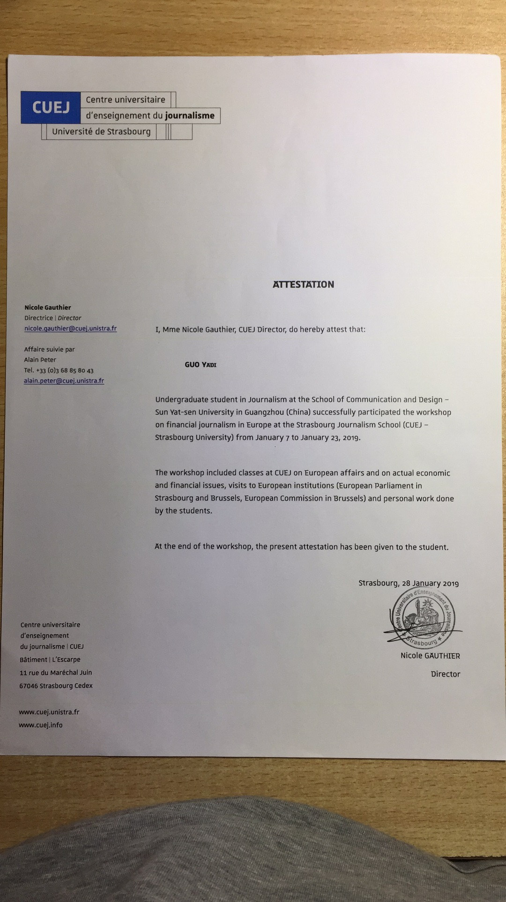

# Yudy's Portfolio
yudyguo@gmail.com | +43 677 623 17415 | www.linkedin.com/in/yadi-guo-8192b8233

## 1. Introduction

Detail-oriented and user-focused UX/UI Designer with strong skills in user research, product thinking, and interaction design. Experienced in leading end-to-end design processes—from discovery to prototyping to delivery—using Figma and structured UX methodologies. A proactive collaborator who communicates clearly with cross-functional teams. 

## 2. Experiences
Product Designer

MQJC Technology · Wocute Project · Full-time | Dec 2022 - Dec 2024 · Guangdong, China · On-site · [UX-Case](https://www.figma.com/design/fpNktyk2LvaJ5YAHEVUgaX/1.9.x?node-id=69-17210&p=f&t=FRTbj3ysGO80bNs4-0)
- Research-Driven Decision Making: Redesigned a cycle tracking tool's UX through behavioral analytics (Hotjar) and In-app surveys, identitying pain points.
- Data-informed Innovation: Shipped A/B-tested features, contributing to a 50% rise in engagement and 31% higher retention within 6 months. 
- Cross-Cultural Design Expertise: Coordinated 8+ cross-functional teams (UX, PM, Legal) to align design decisions with EU privacy regulations (GDPR) and business goals.
- Mentorship and Team Enablement: Trained and mentored 2 junior interns through structured onboarding, design feedback, and workflow guidance, helping them grow into independent contributors.

Interaction Designer

Tencent · WeChat Project · Full-time | May 2021 - Dec 2022 · Guangdong, China · On-site · 
[Portfolio - yadi.pdf](https://github.com/yudyguo/portfolio/blob/main/Portfolio%20-%20yadi.pdf)
- Designed UI and UX for WeChat ecosystem: Delivered polished high-fidelity designs with minimal supervision, taking full ownership of feature-level UX quality.
- Multi-industry Design: Collaborated with PMs, engineers, and data teams and translate cross-industry needs (retail, education, lifestyle services, local businesses) into scalable WeChat product solutions.
- Agile Execution: Managed and executed 50+ WeChat feature releases with a 98% on-time launch rate, adapting design workflows to Tencent’s rigorous quality control, compliance requirements, and fast-paced review cycles.

User Experience Designer

Alipay · Insurance Software Department · Internship | Jul 2020 - Oct 2020 · Shanghai, China · On-site
- Designed the internal platform for merchants on Alipay, China’s largest third-party payment system with over 1 billion users. Conducted user research to optimize workflows.

## 3. Education
M.S. in Human–Computer Interaction | Juli. 2021 | Sun Yat-Sen University [Graduation Thesis-Abstract](https://github.com/yudyguo/portfolio/blob/main/Master-Graduation%20Thesis-Abstract.pdf)

B.A. in Internet and New Media | Juli. 2019 | Sun Yat-Sen University

Exchange Program in Centre Universitaire d’Enseignement du Journalisme (CUEJ), Strasbourg, France |
Completed individual research and oral presentations on European economic issues, evaluated by CUEJ faculty | Oct 2018

## 4. Award
Red Dot Design Award: Design Concept (Finalist) | [2020](https://github.com/yudyguo/portfolio/blob/main/I-Reddot.pdf)

China University Innovation Contest: National 2nd place | [2018](https://github.com/yudyguo/portfolio/blob/main/China%20University%20Innovation%20Contest-National%202nd%20place-2018%20.pdf)

international Genetically Engineered Machine(iGEM): 
Gold medal | Best Software |
Nominated for best applies design | [2017](https://lifesciences.sysu.edu.cn/zh-hans/article/1395)

## 5. Skill
Figma · Sketch · HTML · CSS · ReactJS · Adobe Photoshop · Adobe After Effects · Adobe Illustrator · Premiere · Final Cut Pro

## 6. Language
Chinese · First Language

English · Fluent

Cantonese · Fluent

German · Conversation

Japanese · Conversation

## 7. Abilities
**Build strong relationships** and communicate effectively

**Perform reliably under pressure** while attention to detail

**Adapt** across multiple roles and responsibilities

**Energize teams** with positive and enthusiasm

## 8. Interests
Hiking, Skiing, Travel, Piano, Singing, Dancing

